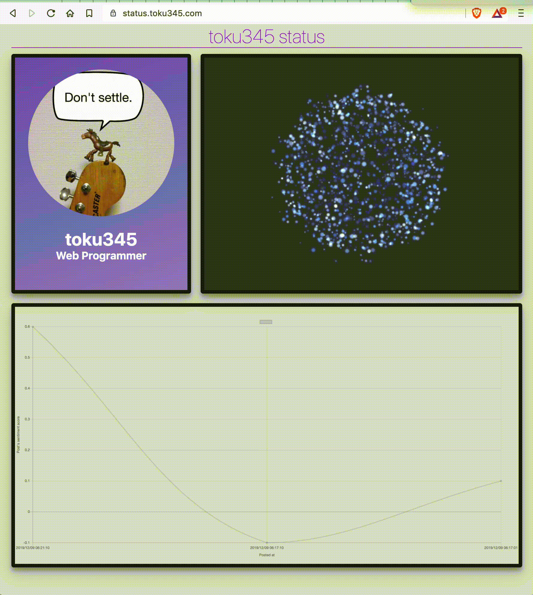
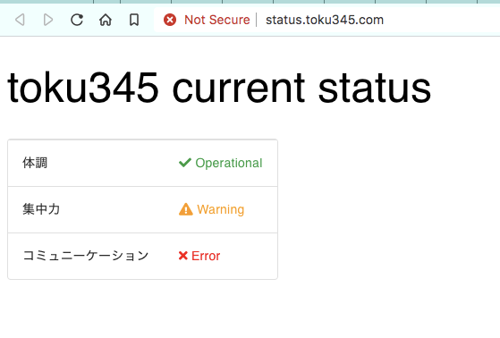
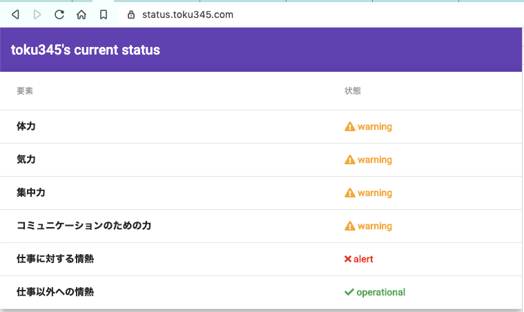
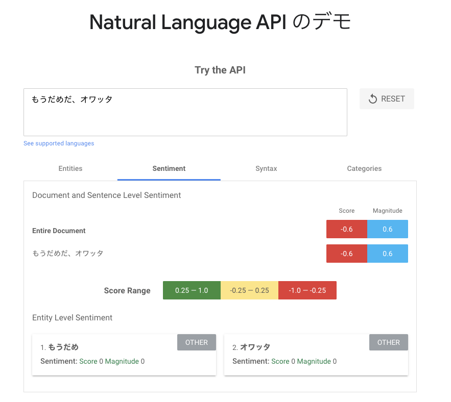
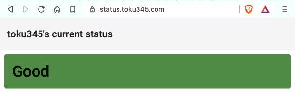
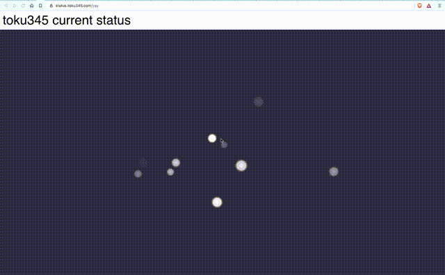

+++
title = "海馬に優しいプログラマーになるために ~自分の感情を見える化してみた~"
author = "toku345"
template = "page.html"
date = 2019-12-10
description = "Classi Advent Calendar 2019 11日目の記事：海馬に優しいプログラマーになるために ~自分の感情を見える化してみた~"

[taxonomies]
categories = []

[extra]
tags = ["tooku345-status"]
+++

この記事は [Classi Advent Calendar 2019](https://qiita.com/advent-calendar/2019/classi) 11日目の記事です。

前日の [fusho-takahashi](https://qiita.com/fusho-takahashi)さんのすごい記事に続いて11日目は不肖徳光こと [@toku345](https://twitter.com/toku345) がお送りします。

今年もお仕事のことは書かないという **マイ制約** があるので、お仕事のことは書きません！

# 今年のテーマ

さて、今年は只今チャレンジ中の「自分の感情の見える化」プロジェクトについてお話させていただきます。

最近の自分の「つぶやき」から「感情」を分析して、現在の状況・感情の推移を見える化してみよう！というプロジェクトです☺️

<figure>
  
  <figcaption style="display: block; text-align: center;">※ 鋭意開発中のため、画面は変更される可能性が多分にあります</figcaption>
</figure>

# モチベーション

今年読んで良かった本の1冊である、吉藤オリィさんの[サイボーグ時代](https://www.amazon.co.jp/dp/4866630620) の中で「海馬に優しい人間になれ」という言葉が出てくるのですが、これがずーっと頭の中に残っていました。[^1]

うーん😑
どうやったら初対面の人に覚えてもらいやすい人間になれるんだろう...

Steve Jobs のように黒のタートルネックを着続けたり、吉藤オリィさんのように[黒い白衣](https://twitter.com/orybotstory/status/1020117428599050240)を着たり、[fusho-takahashi](https://qiita.com/fusho-takahashi)氏のように全身黄色を身に着けたりするといいのかしら？

私も一年中半袖Tシャツを着続けてみているのですが、効果はイマイチ（そりゃ、そうだ）

もっと、プログラマーらしい「海馬に優しい」アプローチができないものか...

そんなことを考えていた明くる日、チームとして進めているプロジェクトの他にもバンバン割り込みタスクを依頼されて疲弊している中、頼みの綱のGitHubがダウン...

**Ooops!!!**

おもむろに [https://www.githubstatus.com/](https://www.githubstatus.com/) を開きながら、あー私もダウンしたいな...と思ったときに閃きました！

自分のstatusページ作ったら面白いかも！
しかも、そんなページ作ってるプログラマーはそんなに多くないだろうから、初対面の人に覚えてもらう際の記憶のhookになりそう！

いいじゃん、いいじゃん☺️
`
ということで、最初は「自分のステータスの見える化」として始まりました。

# 試行錯誤

## 最初は、自分の「ステータス」の見える化

一番最初はめっちゃシンプルにこんな感じに実装しました

次第に項目が増えて、

もっともっと項目が増えて...

1~2代目最後の時期は、若干会社 dis みたいになり始め、ちょっと目指したい方向から遠ざかってきたなと感じてました
また、パラメータの設定は手動でした😭

動的に取得できるようにするために、一日の決まったタイミングでbotとの対話経由で取得することも検討したのですが、
この数のステータス・パラメータを毎回毎回入力するのが超絶億劫そうなので、却下となりました

## 「感情」の見える化へ

どうするか思案する中、ふと普段の Slack / Twitter などの投稿内容から判断できたら面白そうだと思いつきました。

で、早速試してみた結果

いいじゃーん🙌🏻

Sentiment Score を使うことに決めました

では、これをどう表現するか🤔？

こんな感じでシンプルに？

動きのある表現で、感情状態を見えるかしてみる？

# 作ったものお披露目

いろいろ試行錯誤した結果、冒頭にお見せした形に今は落ち着きました

実物は[こちら](https://status.toku345.com/)で触っていただけます。

コードは[こちら](https://github.com/toku345/status)

これは普通の状態

疲れ気味の時はこんな感じ⤵︎

めっちゃハッスルしている時はこんな感じ⤵︎

# 気づき

## 良かったこと
- 自分のためじゃんw

## 失敗したこと

- Svelte のチュートリアルに時間を掛けすぎた
- Svelte でどうテスト書くのかを執拗に調べてしまった
  - でも、今回の目的は Svelte でプロダクト品質を作り込む、ではなく「自分の感情の見える化」を作ってみてどうか？を判断したかったので
- Advent Calendar 書く場所をさまよった結果、前日に環境構築にハッスルしてしまった
  - markdown で書いて、 Zolaで static sites を生成して、firebase hosting でホストしてます
  - この記事しかまだ無いよ🙈
 　- なぜ彷徨ったのか？
    - Qiitaも、はてなブログ（無償版）もバナーが出るのが嫌だったから

# これからやりたいこと

将来的には Vision API を使って感情判定したり、音声を使ってゴニョゴニョやりたいなーと。
またAzureも同じようなAPIを公開してるので、sその比較もやってみよっかな
気が向けばやるかも、です。

Apple Watch とかから、心拍とかとってみたり、マイクで定期的に音声を取得して解析してみるものおもしろそう！

明日は [seiga](https://qiita.com/Seiga) さんです！

予告ではお仕事のコードと関わりがありそうな記事になるかもですね。お楽しみに〜

---

[^1]: もちろん「海馬に優しい人間になれ」以外の箇所もすごく興味深く、気付きが多くてわくわくドキドキするので、年末年始にオススメです！
